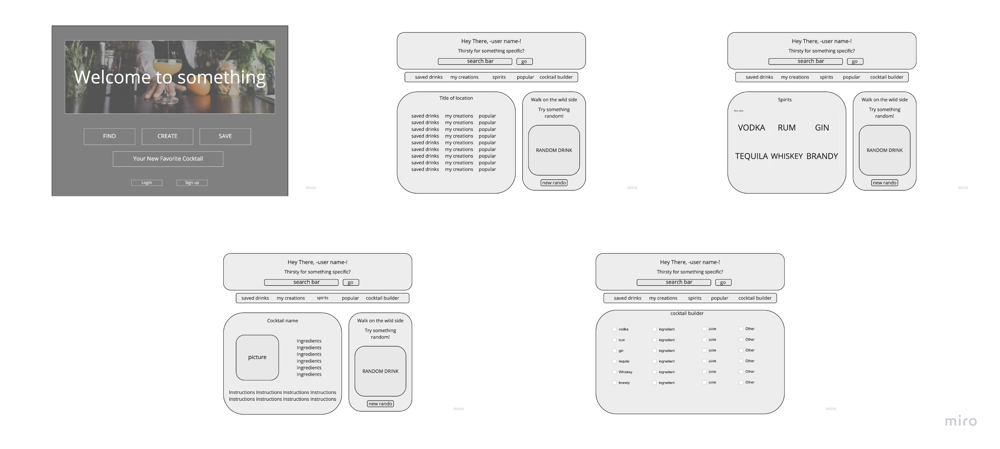

# GA-Solo-Project-2

## Overview

---

-*Insert amazing name here*- is an app for all of your cocktail necessaties. Create  an account and get access to over 500 different recipes. Search for a specific drink or get inspiration by browsing through spirits or most popular. Feeling wild? Try the random drink generator and go for it! If you find a recipe that you like, you can save it to your profile for easy access.

## User Stories

---

 1. When I load the page, I see "Welcome to -*insert amazing name here*-", a brief description, and buttons to either login or sign-up.
 2. When I press sign-up, a form appears promting for my name, email and password.
 3. When I press login, a form appears promting for my email and password.
 4. When I'm logged in, I see my profile which consists of a heading, navagation bar and body. The heading contains my name and a form to search for cocktails. The navagation bar contains "Saved", "My Creations", "Spirits" and "Popular".
 The body shows my saved drinks and a random drink.
 5. When I click on a link in the navagation bar, the body changes to a list of drinks based on whichever I click.
 6. When I click on a drink, the body changes to the ingredients and instructions for the drink as well as a save button.
 7. When I click save, the drink is added to my "Saved Drinks and appears on my list.

 
 

## Routes Inventory

---

| Route       | Description |
| ----------- | ----------- |
| POST /users/signup | add a new user to users table |
| POST /users/login  | send info to back to check password and send user info to the front |
| GET /users/profile | get user info to display profile | 
| POST /cocktails    | add a cocktail to the cocktails table |
| POST /cocktails/saved | add the user and cocktail to the usercocktails table |
| GET /cocktails/saved | get info on all saved cocktails |
| DELETE /cocktails/saved | delete a saved cocktail |

## MVP Checklist

---
1. Set up database, servers, front & back
2. Make tables and associations
3. Set up routes and functions for back end
4. Create basic layout with links and forms
5. Event listeners and functions to get info from cocktail api
6. Create functions for sending info to back end
7. Logged in and logged out 
8. CSS

## Stretch Goals

---

1. Make the cocktail builder work
2. Add more search options
3. Make it gorgeous